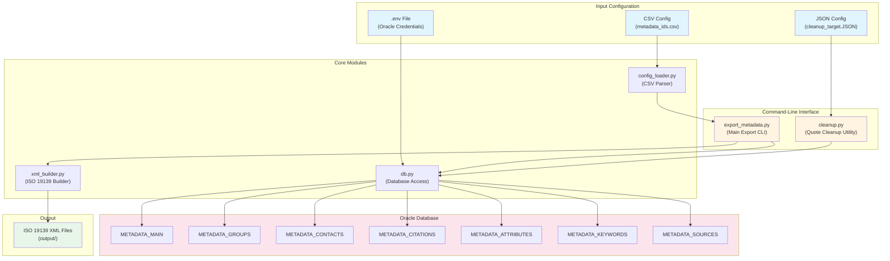
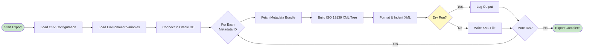
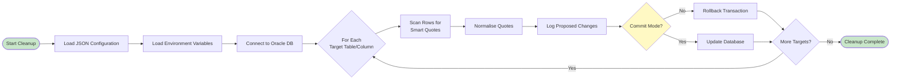
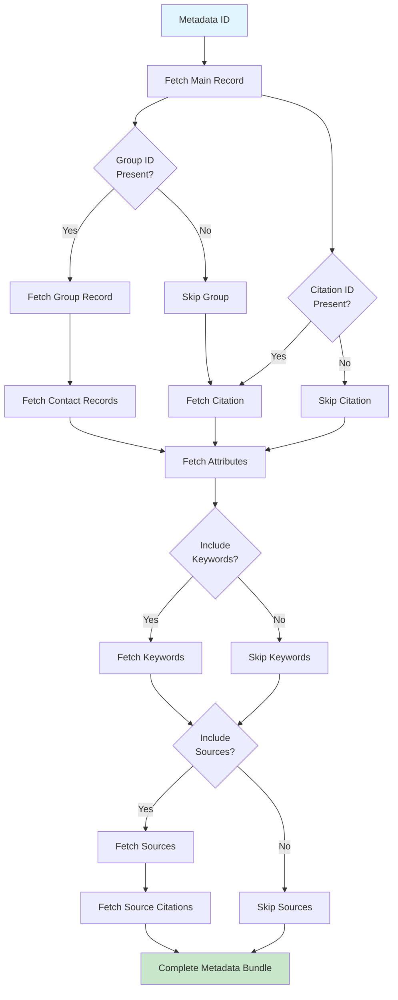

# LandIS Portal - Metadata Exporter System Architecture

This document provides detailed system architecture diagrams for the LandIS Portal Metadata Exporter.

## System Overview

The metadata exporter system consists of two main workflows:

1. **Metadata Export Workflow**: Exports metadata records from Oracle database to ISO 19139-compliant XML files
2. **Quote Cleanup Workflow**: Normalises smart quotes and special characters in database metadata fields

## High-Level Architecture

## Metadata Export Workflow

The export process reads configuration, connects to the database, fetches metadata records, and generates ISO 19139 XML files.

## Quote Cleanup Workflow

The cleanup process scans database tables for smart quotes and normalises them to ASCII equivalents.

## Metadata Bundle Assembly

When exporting a metadata record, the system assembles a comprehensive bundle from multiple related database tables:

## Component Responsibilities

### Command-Line Interfaces

- **export_metadata.py**: Main entry point for metadata export operations
  - Parses command-line arguments
  - Loads configuration and environment variables
  - Orchestrates the export process
  - Handles logging and error reporting

- **cleanup.py**: Quote normalisation utility
  - Loads cleanup target configuration
  - Scans database tables for smart quotes
  - Applies normalisation with optional dry-run mode
  - Manages database transactions

### Core Modules

- **config_loader.py**: Configuration management
  - Parses CSV export configuration files
  - Validates configuration entries
  - Provides structured configuration objects

- **db.py**: Database access layer
  - Manages Oracle database connections
  - Provides query functions for all metadata tables
  - Assembles complete metadata bundles
  - Handles connection lifecycle

- **xml_builder.py**: XML generation
  - Constructs ISO 19139-compliant XML structures
  - Maps database records to XML elements
  - Handles namespaces and formatting
  - Generates complete metadata documents

## Database Schema Relationships

The system queries the following Oracle database tables:

- **METADATA_MAIN**: Primary metadata records
- **METADATA_GROUPS**: Group-level metadata and constraints
- **METADATA_CONTACTS**: Contact information for groups and metadata
- **METADATA_CITATIONS**: Citation information for datasets
- **METADATA_ATTRIBUTES**: Attribute definitions and schema information
- **METADATA_KEYWORDS**: Keyword classifications
- **METADATA_SOURCES**: Source lineage information
- **METADATA_MAIN_SOURCE**: Junction table linking metadata to sources
- **METADATA_SOURCE_CITATION**: Junction table linking sources to citations

## Data Flow Summary

1. **Configuration Input**: CSV or JSON configuration files define what to process
2. **Environment Setup**: `.env` file provides Oracle database credentials
3. **Database Connection**: System connects to Oracle using python-oracledb
4. **Data Retrieval**: Queries fetch related records from multiple tables
5. **Data Assembly**: Records are assembled into structured bundles
6. **XML Generation**: Bundles are transformed into ISO 19139 XML format
7. **Output**: XML files are written to the specified output directory

## Error Handling

- Database connection errors are caught and reported with helpful messages
- Missing configuration files raise `FileNotFoundError` with clear paths
- Invalid configuration data raises `ValueError` with specific details
- Missing metadata records raise `LookupError` with the metadata ID
- All errors are logged with appropriate context for debugging

