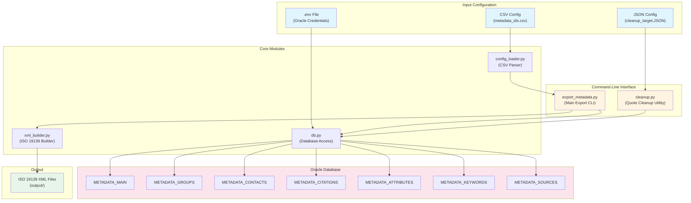
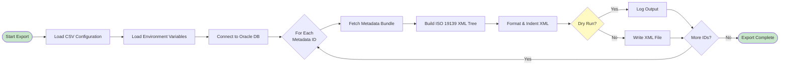
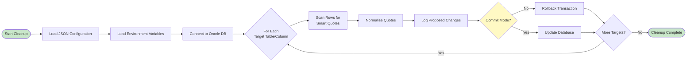
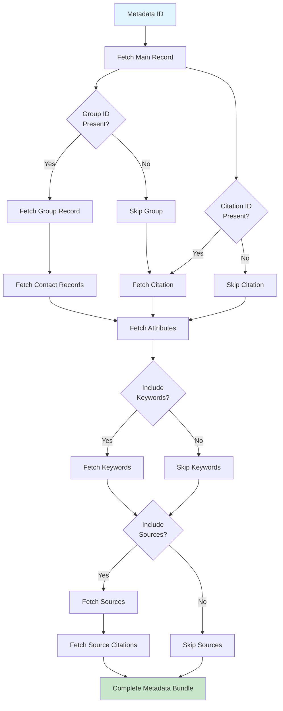

# LandIS Portal - Metadata Exporter

Utility scripts for exporting Land Information System, LandIS metadata records to ISO 19139 XML files.

**Project:** LandIS Portal  
**Institution:** Cranfield University  
**Author:** Professor Stephen Hallett  
**Website:** <http://www.landis.org.uk>

## Overview

This package provides command-line tools for:

- Exporting metadata records from Oracle databases to ISO 19139-compliant XML files
- Cleaning source database data, normalising quotation marks and special characters in metadata fields
- Managing metadata export configurations, controlled via CSV files

## System Architecture

The following diagram illustrates the high-level architecture and data flow of the metadata exporter system:



### Export Workflow

The metadata export process follows these steps:



### Cleanup Workflow

The quote cleanup process follows these steps:



### Data Flow: Metadata Bundle Assembly

When exporting a metadata record, the system assembles a comprehensive bundle from multiple database tables:



## Prerequisites

- Python 3.11 or newer
- Oracle credentials with access to the required metadata tables
- Optional: Oracle Instant Client libraries if they are not already available on the host

## Installation

### 1. Clone the Repository

```bash
git clone <repository-url>
cd metadata
```

### 2. Create a Virtual Environment

A sensible precaution to prevent spillover of the project to any other local setups.

```bash
python -m venv venv
```

### 3. Activate the Environment

Once venv in place, it is activated.

- **Command Prompt (Windows):** `venv\Scripts\activate.bat`
- **PowerShell (Windows):** `.\venv\Scripts\Activate.ps1`
- **Git Bash or POSIX shells (Linux/macOS):** `source venv/bin/activate`

### 4. Install Dependencies

Dependencies installed into venv.

```bash
pip install -r requirements.txt
```

Or install manually:

```bash
pip install oracledb python-dotenv
```

## Configuration

### Environment Variables

The exporter reads Oracle connection settings from environment variables. These are typically kept in a `.env` file alongside the project (note: `.env` files are excluded from version control/git version for security).

Create a `.env` file in the project root:

```env
ORACLE_USER=<your_username>
ORACLE_PASSWORD=<your_password>
ORACLE_DSN=<your_dsn>
```

**Optional:** If your host requires Oracle Instant Client, set:

```env
ORACLE_CLIENT_LIB_DIR=/path/to/instantclient
```

The CLI automatically loads the `.env` file supplied via `--env-file` (defaults to `.env`).

### Export Configuration

A control file dictates which data features get metadata output files processed. There is a list of metadata identifiers to export placed in `config/metadata_ids.csv`. A couple of examples are given below:

```csv
metadata_id,include_sources,include_keywords
HORIZONS,true,true
NATMAP5000,true,true
```

- `metadata_id`: The identifier of the metadata record to export (required)
- `include_sources`: Include source lineage information (default: `true`)
- `include_keywords`: Include keyword metadata (default: `true`)
- Comment lines beginning with `#` are ignored

## Usage

### Exporting Metadata

From the project root with the virtual environment active:

```bash
python -m metadata_exporter.export_metadata --config config/metadata_ids.csv --output-dir output
```

**Options:**

- `--config`: Path to CSV file listing metadata IDs to export (default: `config/metadata_ids.csv`)
- `--output-dir`: Directory where XML files will be written (default: `output`)
- `--dry-run`: Fetch records without writing XML files, useful for validation
- `--env-file`: Path to `.env` file containing Oracle credentials (default: `.env`)

**Example with dry-run:**

Note the dry run option allows the tool to be run without committing the data to file - it just shows what it 'would' do. Can be useful for testing.

```bash
python -m metadata_exporter.export_metadata --config config/metadata_ids.csv --output-dir output --dry-run
```

Each metadata identifier listed in the configuration CSV results in one XML file under the output directory, named `{metadata_id}.xml`.

### Quote Cleanup Utility

In the database, there can be problems in the UTF-8 symbols in the text. This often occurs from copying text from Word into the database, and especially with 'smart quotes'. Mis-encoded punctuation occasionally finds its way into title and abstract fields. The quote cleanup utility normalises curly quotation marks and related glyphs to plain ASCII quotes whilst logging every proposed change. Again a useful dry-run option is offered.

#### Cleanup Configuration

List the tables and columns you wish to scan in `config/cleanup_target.JSON`. Each entry supports:

- `table`: Fully qualified table name, for example `ADMIN.METADATA_MAIN`. (the table METADATA_MAIN from the ADMIN schema)
- `column`: The column that requires scanning and fixing
- `identifier` (optional): Additional column to include in the log output for easier traceability
- `where` (optional): SQL predicate/filter narrowing the scan, for example `METADATA_ID LIKE 'NATMAP%'`

**Example configuration:**

```json
[
    {
        "table": "ADMIN.METADATA_MAIN",
        "column": "TITLE",
        "identifier": "METADATA_ID"
    },
    {
        "table": "ADMIN.METADATA_MAIN",
        "column": "ABSTRACT",
        "identifier": "METADATA_ID"
    }
]
```

#### Dry-run and Commit Workflow

1. Review or amend the sample configuration in `config/cleanup_target.JSON`
2. Execute a dry-run to review proposed changes:

   ```bash
   python -m metadata_exporter.cleanup --config config/cleanup_target.JSON
   ```

3. After reviewing the log output, re-run with `--commit` to apply the updates atomically:

   ```bash
   python -m metadata_exporter.cleanup --config config/cleanup_target.JSON --commit
   ```

**Options:**

- `--config`: Path to JSON configuration file describing cleanup targets (required)
- `--env-file`: Optional path to a `.env` file containing Oracle credentials (default: `.env`)
- `--commit`: Apply updates instead of running in dry-run mode
- `--verbose`: Enable verbose logging for diagnostic purposes

The script uses the same environment variables as the exporter; supply an alternate `.env` file via `--env-file` when required.

## Oracle Instant Client (Optional)

If the host requires Instant Client, download and extract it, then point `ORACLE_CLIENT_LIB_DIR` at the extracted folder. The exporter initialises the client automatically when the variable is present.

## Testing

Run the unit tests with pytest:

```bash
python -m pytest
```

Or with verbose output:

```bash
python -m pytest -v
```

## Troubleshooting

### Missing `python-oracledb`

Install with:

```bash
pip install oracledb
```

### `.env` Not Loading

Ensure `python-dotenv` is installed:

```bash
pip install python-dotenv
```

Alternatively, export variables via the shell:

```bash
export ORACLE_USER=<username>
export ORACLE_PASSWORD=<password>
export ORACLE_DSN=<dsn>
```

### Permission Errors in PowerShell

Run the following before activation:

```powershell
Set-ExecutionPolicy -Scope Process RemoteSigned
```

### Connection Errors

Verify your Oracle credentials and DSN are correct. Test connectivity using Oracle SQL*Plus or another Oracle client tool.

## Development

### Code Style

- Code follows `black`-compatible formatting and PEP 8 guidelines
- All comments and documentation use UK English spelling
- Type hints are used throughout for better code clarity

### Project Structure

```text
metadata/
├── config/
│   ├── cleanup_target.JSON    # Configuration for quote normalisation
│   └── metadata_ids.csv       # List of metadata IDs to export
├── helper_files/
│   ├── HORIZONS.xml           # Example XML output
│   └── metadata_schema.sql    # Database schema reference
├── metadata_exporter/
│   ├── __init__.py
│   ├── cleanup.py             # Quote normalisation utility
│   ├── config_loader.py       # CSV configuration loading
│   ├── db.py                  # Database connection and queries
│   ├── export_metadata.py     # Main export CLI
│   └── xml_builder.py         # ISO 19139 XML construction
├── output/                    # Generated XML files (gitignored)
├── tests/
│   └── test_quote_cleanup.py   # Unit tests for normalisation
├── .env                       # Environment variables (gitignored)
├── .gitignore
├── requirements.txt
└── README.md
```

### Contributing

When contributing to this project:

1. Follow PEP 8 style guidelines
2. Use UK English spelling in comments and documentation
3. Add type hints to all functions
4. Write unit tests for new functionality
5. Update documentation as needed
6. Keep new features modular to aid future expandability

## License

See licence file.

## Support

For issues, questions, or contributions, please contact the project maintainer or refer to the [LandIS Portal website](http://www.landis.org.uk).
